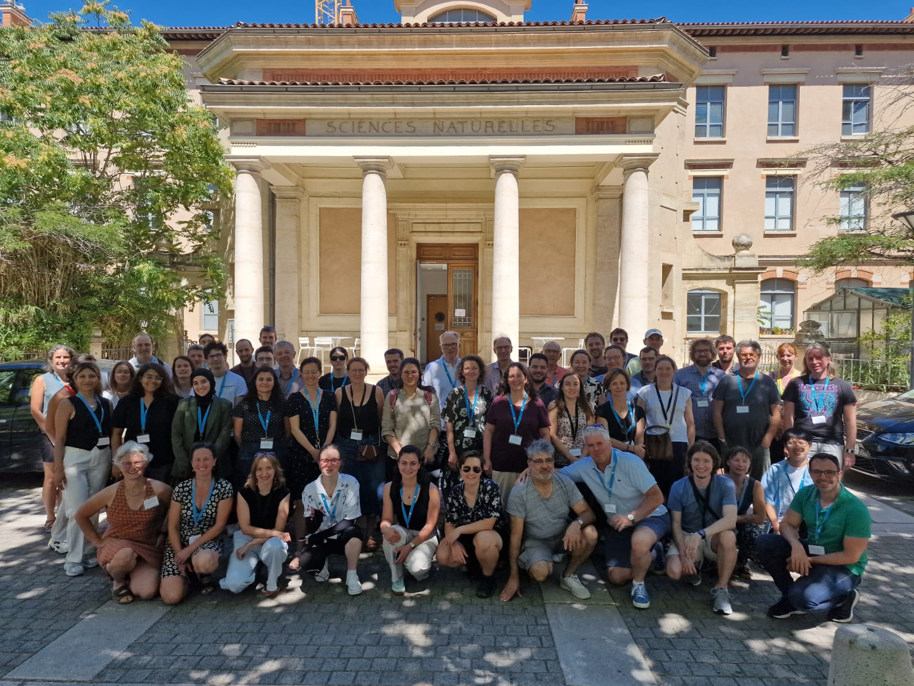
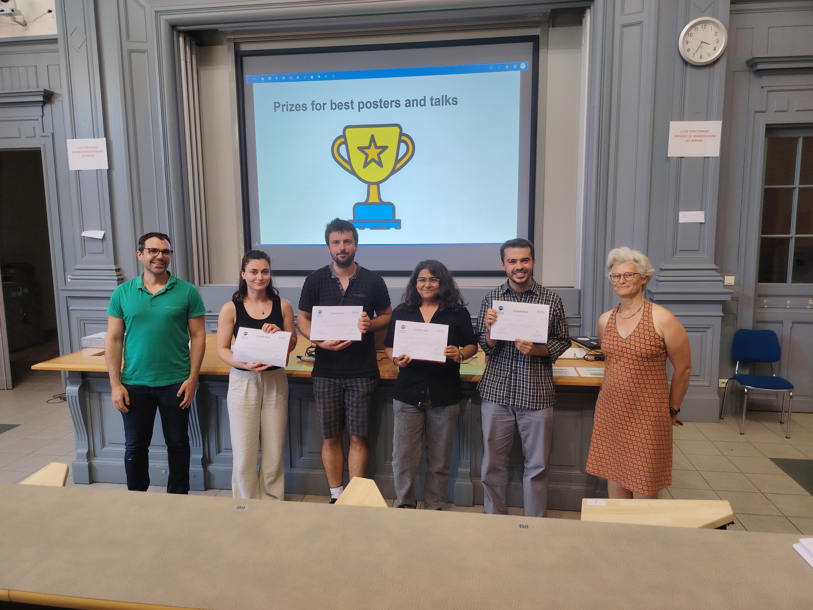

<html>

<body>

Atmospheric chemistry is at the heart of the main societal challenges concerning the environment and health, climate change and environmental transition. Nevertheless, one of the major current difficulties remains the reduction of uncertainties related to the role of heterogeneous and multiphase chemistry and the transposition of knowledge acquired in the laboratory (by multiple approaches) to atmospheric models. To progress on these reactivity issues, this workshop will strengthen interactions with theoretical physical chemistry to address the future challenges in the field.

<a href="https://listes.services.cnrs.fr/wws/subscribe/atmotheory" target="_blank"> Click here to register to the Atmospheric Theoretical Chemistry (CAT) Newsletter</a>

<b>Thanks for participating!</b>

<b>Congratulations to the winners of best poster/oral presentations:</b>
<ul>
  <li>Enida Nushi, best poster presentation prize (experiment)</li>
  <li>Jim Grisillon, best oral presentation prize (experiment)</li>
  <li>Madhumita Chakraborty, best poster presentation prize (theory)</li>
  <li>Miguel de la Puente, best oral presentation prize (theory)</li>
</ul>

<b>Organizers:</b> 
<ul>
  <li>Miquel Huix-Rotllant, (ICR) – AMU</li>
  <li>Anne Monod, (LCE) – AMU </li>
</ul>

<b>Scientific Committee:</b> 
<ul>
  <li>Jean-Louis Clément, (ICR) – AMU</li>
  <li>Manuela Cirtog, (LISA) - Université Paris-Cité, membre CES CHAT</li>
  <li>Barbara D’Anna (LCE) – CNRS</li>
  <li>Barbara ERVENS (ICCF) – CNRS</li>
  <li>Julien Kammer (LCE) – AMU</li>
  <li>Max McGillen (ICARE) – CNRS</li>
  <li>Sylvain Picaud (UTINAM) - CNRS</li>
  <li>Benedicte Picquet-Varrault (LISA) - Université Paris-Cité</li>
  <li>Manuel F. Ruiz-Lopez (LPCT) - CNRS</li>
  <li>Sophie Sobanska (ISM) - CNRS</li>
  <li>Florent Louis (PC2A) – Université de Lille</li>
  <li>Josene Toldo (LCH) – UCBL, ENS de Lyon</li>
  <li>Céline Toubin (PhLAM) - Université de Lille</li>
</ul>

</body>
</html>
